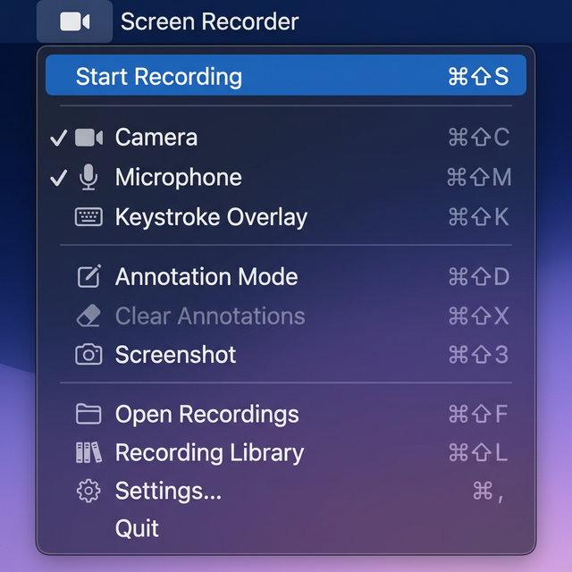
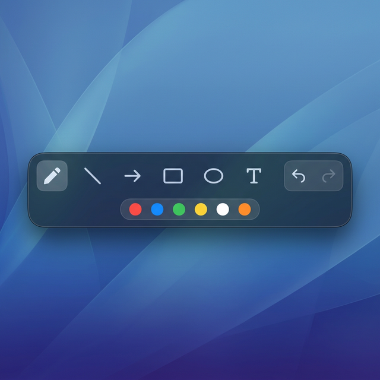
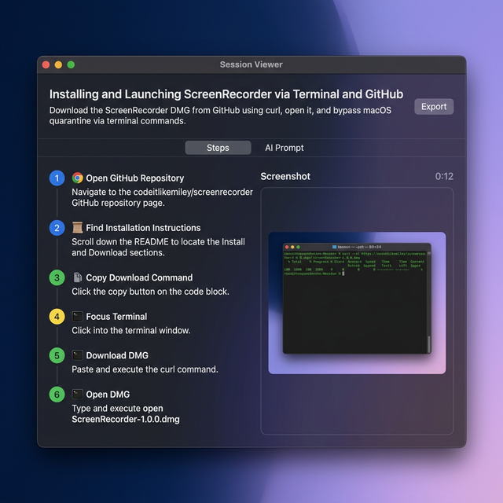
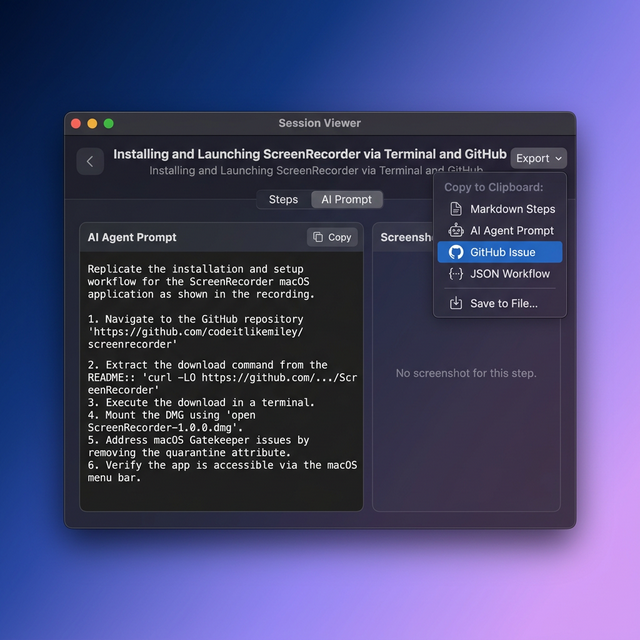
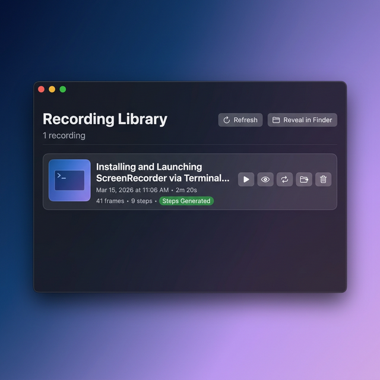

# Screen Recorder

A native macOS screen recorder designed for developers. Record your screen, camera, and microphone with global hotkeys — then let AI generate step-by-step workflow documentation from your recordings.


[](https://github.com/codeitlikemiley/screenrecorder/actions/workflows/release.yml)

<p align="center">
  
</p>

## Features

- **Screen Recording** — Native retina resolution via ScreenCaptureKit
- **Camera Overlay** — Circular, draggable webcam preview composited into the recording
- **Microphone + System Audio** — Voice and system audio with adjustable mic volume
- **Keystroke Overlay** — Floating key display with coalescing and repeat counts
- **Noise Suppression** — macOS Voice Isolation for clean audio
- **Global Hotkeys** — Fully customizable, works from any app
- **HEVC (H.265)** — ~50% smaller files than H.264
- **AI Step Generation** — Analyze recordings with OpenAI, Anthropic, Gemini, or any compatible API
- **Recording Library** — Browse, re-process, and manage all past recordings
- **CLI + MCP Server** — Bundled inside the app, installable from Settings
- **License Gating** — Activate via CLI or in-app Settings; features lock until activated
- **Menu Bar App** — Lives in the menu bar, no dock icon

## Install

### Homebrew (Recommended)

One command installs the app, CLI (`sr`), and MCP server (`sr-mcp`):

```bash
brew install --cask codeitlikemiley/tap/screenrecorder
```

This automatically:
- Installs `ScreenRecorder.app` to `/Applications`
- Creates `/usr/local/bin/sr` and `/usr/local/bin/sr-mcp` symlinks
- Removes Gatekeeper quarantine

### Download DMG

1. Download the latest DMG from [**Releases**](https://github.com/codeitlikemiley/screenrecorder/releases/latest):

   ```bash
   curl -LO https://github.com/codeitlikemiley/screenrecorder/releases/download/v1.0.0/ScreenRecorder-1.0.0.dmg
   ```

2. Open the `.dmg` and drag **Screen Recorder** to **Applications**.

3. On first launch, macOS may show a Gatekeeper warning:

   ```bash
   xattr -d com.apple.quarantine /Applications/Screen\ Recorder.app
   ```

4. **Install CLI tools**: Open **Settings → CLI Tools → Install CLI Tools** to create terminal commands.

### Build from Source

```bash
git clone https://github.com/codeitlikemiley/screenrecorder.git
cd screenrecorder

# Create .env with your signing identity
cat > .env << 'EOF'
SIGNING_IDENTITY="Developer ID Application: Your Name (XXXXXXXXXX)"
APPLE_TEAM_ID="XXXXXXXXXX"
SR_LICENSE_SERVER=http://localhost:3000   # optional, for local dev
EOF

./build.sh
open .build/ScreenRecorder.app
```

> Requires macOS 14+ and Xcode Command Line Tools. See [docs/DEVELOPMENT.md](docs/DEVELOPMENT.md) for details.

## License Activation

A license key is required to use recording features. Without one, the menu bar shows **🔑 Activate License** and recording/annotation features are disabled.

### Get a License Key

Sign up at [screenrecorder.dev](https://screenrecorder.dev) to get your license key.

| Plan | MCP Tool Calls | Price |
|------|---------------|-------|
| Free | 100 / day | $0 |
| Pro | Unlimited | $9/mo |

### Activate

**In the app**: Settings → License → paste key → Activate

**Via CLI**:

```bash
sr activate SR-XXXX-XXXX-XXXX-XXXX
```

License data is stored in a shared `UserDefaults` suite — activating in one place works everywhere (app, CLI, MCP server).

```bash
# Check status
sr status

# Deactivate
sr deactivate
```

## Global Hotkeys

All hotkeys are customizable in **Settings → Shortcuts**. Hotkeys only work when a license is activated.

### Recording & Capture

| Default Shortcut | Action |
|------------------|--------|
| `⌘⇧4` | Start / Stop recording |
| `⌘⇧S` | Start / Stop recording (alt) |
| `⌘⇧3` | Annotation screenshot (save to file) |
| `⌘⇧⌥3` | Annotation screenshot (alt) |
| `⌘⇧C` | Toggle camera |
| `⌘⇧M` | Toggle microphone |
| `⌘⇧K` | Toggle keystroke overlay |
| `⌘⇧H` | Show / Hide control bar |
| `⌘⇧F` | Open recordings folder |
| `⌘⇧L` | Recording Library |
| `⌘⇧=` | Mic volume up |
| `⌘⇧-` | Mic volume down |
| `⌘⇧0` | Reset mic volume |
| `⌘,` | Open settings |

### Annotation (Doodle Mode)

| Default Shortcut | Action |
|------------------|--------|
| `⌘⇧D` | Toggle annotation mode |
| `⌘⇧X` | Clear annotations |
| `⌘1` | Pen tool |
| `⌘2` | Line tool |
| `⌘3` | Arrow tool |
| `⌘4` | Rectangle tool |
| `⌘5` | Ellipse tool |
| `⌘6` | Text tool |
| `⌘Z` | Undo annotation |
| `⌘⇧Z` | Redo annotation |

<p align="center">
  
</p>

> ⚠️ **macOS Screenshot Conflict:**
> `⌘⇧3` and `⌘⇧4` conflict with macOS default screenshot shortcuts. Each has an alt fallback (`⌘⇧S` and `⌘⇧⌥3`) that works without changes. For the best experience, disable the macOS defaults:
>
> **System Settings → Keyboard → Keyboard Shortcuts → Screenshots** → uncheck `⌘⇧3`, `⌘⇧4`, and `⌘⇧5`.

## AI Step Generation

After recording, the app analyzes your session and generates step-by-step workflow documentation using AI.

**Setup:** Go to **Settings** (`⌘,`) → **AI Providers** → **Add Provider** and pick a preset:

| Protocol | Presets |
|----------|---------|
| **OpenAI** | OpenAI, DeepSeek, Qwen, Groq, Kimi, GLM, MiniMax |
| **Anthropic** | Anthropic, MiniMax, Kimi, GLM |
| **Gemini** | Google Gemini |

Each provider is a fully editable **profile** — configure the base URL, model, max tokens, temperature, and API keys. You can add multiple profiles and switch between them at any time.

Want to use a **local model**? Add a Custom Provider pointing to Ollama, LM Studio, or any OpenAI/Anthropic-compatible endpoint.

> See [docs/AI_PROVIDERS.md](docs/AI_PROVIDERS.md) for the full provider list, custom endpoint setup, and configuration guide.

### Generated Artifacts

Each recording produces a set of files in your recordings directory (`~/Movies/ScreenRecorder/` by default):

```
Recording_2026-03-15_04-30-00.mov          # Screen recording (HEVC)
Recording_2026-03-15_04-30-00_session.json  # Session metadata (duration, events, keystrokes)
Recording_2026-03-15_04-30-00_workflow.json # AI-generated step-by-step workflow
Recording_2026-03-15_04-30-00_frames/       # Extracted key frames (PNG)
```

| File | Description |
|------|-------------|
| `_session.json` | Recording metadata — date, duration, input events, processing state |
| `_workflow.json` | AI-generated workflow with titled steps, descriptions, and frame references |
| `_frames/` | Key frames extracted from the video, used as context for AI analysis |

## Session Viewer

After a recording is processed, the **Session Viewer** opens automatically. You can also reopen any past session from the Recording Library.

The viewer is a split-pane interface:

- **Steps Panel** (left) — AI-generated step-by-step workflow with numbered steps, action types, and descriptions
- **Screenshot Preview** (right) — Key frame for the selected step, synced to your selection
- **AI Prompt Tab** — View or copy the raw prompt used for AI analysis

<p align="center">
  
</p>

### Editing Steps

Steps are fully editable inside the viewer:

- **Edit** title and description inline
- **Reorder** steps via drag-and-drop
- **Delete** steps you don't need

### Exporting

Click **Export** in the title bar to copy or save the workflow:

| Format | Description |
|--------|-------------|
| **Markdown Steps** | Full document with steps, screenshots, and metadata |
| **AI Agent Prompt** | Ready-to-paste prompt for Cursor, Copilot, Codex, etc. |
| **GitHub Issue** | Issue body with task checklist and context |
| **JSON Workflow** | Machine-readable workflow for automation |

<p align="center">
  
</p>

## Recording Library

Access all past recordings from the menu bar via **📚 Recording Library**.

- **Browse** — View all recordings with thumbnails, dates, duration, and status badges (`Steps Generated`, `Unprocessed`, `Processing`, `Failed`)
- **Open** — Double-click or hit the eye icon to load the session in the Session Viewer
- **Re-process** — Re-run AI analysis with a different provider or updated settings (reuses existing frames, skips re-extraction)
- **Delete** — Remove a recording and all its associated artifacts (video, session, workflow, frames) with confirmation
- **Reveal in Finder** — Jump to the recording file in Finder

<p align="center">
  
</p>

## CLI

The `sr` binary is bundled inside `ScreenRecorder.app` and installed to `/usr/local/bin/sr` via Homebrew or in-app Settings.

```bash
# Activate your license
sr activate SR-XXXX-XXXX-XXXX-XXXX

# Check app status
sr status

# Start/stop recording
sr record start
sr record stop

# Take a screenshot
sr screenshot --output ~/Desktop/shot.png

# Annotations
sr annotate add --type arrow --points 100,100,300,200 --color red
sr annotate undo
sr annotate clear

# Switch drawing tool
sr tool select pen
```

> The `sr` CLI requires the Screen Recorder app to be running.

## MCP Server (AI Tool Integration)

The MCP server (`sr-mcp`) is also bundled inside the app. It lets AI assistants (Claude Code, Cursor, Windsurf, etc.) control the app programmatically.

### Setup

1. **Install** via Homebrew or Settings → CLI Tools → Install CLI Tools

2. **Add to your MCP client config:**

   **Claude Code** (`~/.claude.json`):

   ```json
   {
     "mcpServers": {
       "screen-recorder": {
         "command": "/usr/local/bin/sr-mcp",
         "args": ["serve"]
       }
     }
   }
   ```

   **Cursor** (`.cursor/mcp.json`):

   ```json
   {
     "mcpServers": {
       "screen-recorder": {
         "command": "/usr/local/bin/sr-mcp",
         "args": ["serve"]
       }
     }
   }
   ```

3. **Make sure Screen Recorder is running** — the MCP server proxies tool calls to the app via its local JSON-RPC server.

### Available Tools

| Tool | Description |
|------|-------------|
| `screen_recorder_status` | Get current recording state |
| `screen_recorder_start` | Start recording |
| `screen_recorder_stop` | Stop recording |
| `screen_recorder_screenshot` | Capture a screenshot |
| `screen_recorder_annotate` | Add, undo, or redo annotations |
| `screen_recorder_annotate_clear` | Clear all annotations |
| `screen_recorder_tool` | Select drawing tool (pen, arrow, rectangle, etc.) |
| `screen_recorder_usage` | Check license plan and daily usage |

## Architecture

```
ScreenRecorder.app/Contents/MacOS/
├── ScreenRecorder    # Main GUI app (menu bar)
├── sr                # CLI binary
└── sr-mcp            # MCP server binary
```

All three binaries share license data via a `UserDefaults` suite (`com.codeitlikemiley.screenrecorder.shared`). Activating a license in any one of them makes it available to the others instantly.

## Documentation

| Doc | Description |
|-----|-------------|
| [AI Providers](docs/AI_PROVIDERS.md) | Full AI provider setup, presets, custom endpoints |
| [Architecture](docs/ARCHITECTURE.md) | Source tree, design patterns, request flow |
| [Development](docs/DEVELOPMENT.md) | Build, permissions, config storage |
| [Release](docs/RELEASE.md) | Signing, notarization, DMG creation |
| [Contributing](docs/CONTRIBUTING.md) | How to contribute, PR guidelines |

## License

[MIT](LICENSE)
